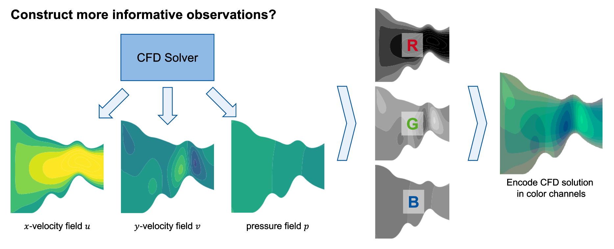

Image based Observations
========================

.. Note:: This functionalty has been reworked and the documentation is not up to date. Please check the schema for the renamed/relocated options and functionality.

.. Note:: The solver used in this example is not openly available. The functionality after creating the image should work with any solver.

The framework has now the ability to not only use the spline coordinates as the
observations but it can also use image based observations. These use flow
field information directly from the solver to create a false color image of
the flow field. This means that this feature is currently only available in
conjunction with the **XNS** solver, from CATS RWTH Aachen. Other solver would
need to either do **one** of these options:

#. export the results to the same location and in the same format
#. the image exporter in the framework would need to be extended to this solver specifically.
#. add a SPOR step which takes the solver results and

converts them into the XNS format and to the correct location

Here I will assume the framework can read the results correctly.

Activating of the options
-------------------------

To use the image based observations two options need to be changed in the json
file. But these can have some consequential changes. Please think through them.

The two main changes are:

#. environment.use_cnn_observations = true
#. agent.policy = ["CnnPolicy", "MultiInputPolicy"]

The second change is either the on evalue or the other depending on wheter
only image based observations are present (CnnPolicy) or also other
observations are present (MultiInputPolicy).

In the channel test case, used while developing and validating this framework,
only the image observations were necessary. A second test case using the
geometry of a t-junction at least a second value had to be also added.
Therefore the MultiInputPolicy was needed in the second case. Please check the
SPORObjects you have defined if they produce additional observations. (A nice
hack in this regard is that if the additional observations are set to 0, the
framework does not check if observations are set, even if there are some they
will be ignored)

Flow Field Image creation
-------------------------

The way the flow field image is created is by combining the gray scale
contour representations of the x-,y- velocity field and that of the pressure
field. Each gray scale image is used as one color channel of the resulting
image.

A respresentation of this is shown in the following image.

